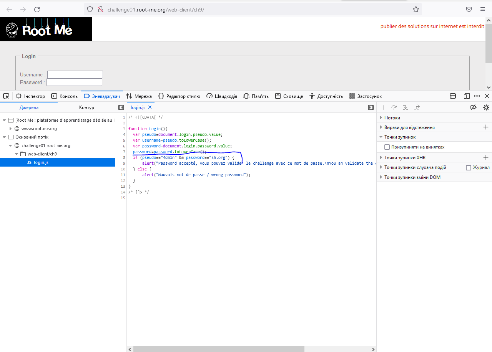

1.  log:4dm1n
    pass:sh.org

    

2.  cpasbiendurpassword
    
    
3.  YmFuYW5hcw==
    
    
4.  якщо я правильно зрозумів,то має виглядати ось так:
    https://surfruit.github.io/iframe/

5.  WWVhLCBkZWJ1Z2dlciBpcyB0aGUga2V5
    
6.  Код знайшов:
    // task\_\_6.html

змінити не знаю як

дякую
